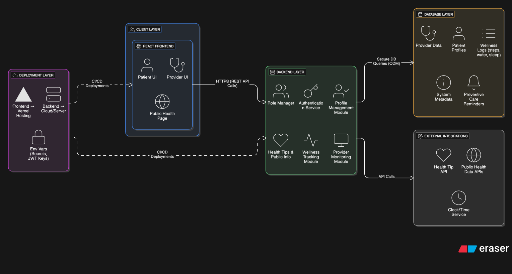

# Healthcare Wellness & Preventive Care Portal

## Team Members & Task Division

*Member 1:* Backend APIs (goals, provider endpoints, business logic)
*Member 2:* Frontend Pages (all UI components and pages)
*Member 3:* Database Setup (MongoDB, schemas, data operations)
*Member 4:* Authentication (registration, login, JWT, security)
*Member 5:* Integration & Deployment (connect everything, deploy)

---

## What We're Building

A healthcare portal where:
- *Patients* track daily wellness goals (steps, water intake)
- *Healthcare Providers* monitor their assigned patients' progress

---

## System Architecture

## Technical Stack

*Frontend:* React + Tailwind CSS  
*Backend:* Python + FastAPI  
*Database:* MongoDB Atlas  
*Auth:* JWT + Bcrypt  
*Hosting:* Vercel (frontend) + Render (backend)

---

## System Architecture

Browser (React.js) 
    ↓
FastAPI (REST APIs)
    ↓
MongoDB (Database)

*Flow:*
User interacts with UI → Frontend calls API → Backend processes → Database stores/retrieves → Response back to user

---

## Database Design

### Collections:

*users*
- id, name, email, password (hashed), role (patient/provider)

*goals*
- id, patient_id, date, steps, water_glasses

*patient_providers*
- patient_id, provider_id (who can see whom)

*reminders* (optional)
- patient_id, message, due_date

---

## API Endpoints

### Auth
- POST /auth/register - Sign up
- POST /auth/login - Sign in

### Patient
- POST /goals - Add daily goal
- GET /goals/today - Get today's data
- GET /goals/history - Past week data

### Provider
- GET /provider/patients - My patient list
- GET /provider/patient/{id}/goals - Patient's goal history

---

## Pages Needed

### Public
- Login page
- Registration page

### Patient
- Dashboard (show today's goals, add new goals)
- Reminders list

### Provider
- Dashboard (patient list)
- Patient detail view (click to see individual patient data)

---

## Security

- Passwords hashed with Bcrypt
- JWT tokens for session management
- Token sent in Authorization header with every request
- Backend validates token before processing
- Role-based access (patients see only their data, providers see only assigned patients)

---

## Task Breakdown

### Member 1 - Backend APIs

- Set up FastAPI project structure
- Create endpoints for goals (add, get today, get history)
- Create endpoints for provider (get patients, get patient details)
- Add data validation with Pydantic
- Handle errors properly

*Dependencies:* Needs Member 3's database functions, Member 4's auth middleware

---

### Member 2 - Frontend Pages

- Set up Next.js project
- Build login and registration pages
- Create patient dashboard with goal form
- Create provider dashboard with patient list
- Make it look clean with Tailwind CSS
- Connect all pages to backend APIs

*Dependencies:* Needs Member 4's auth working, Member 1's APIs ready

---

### Member 3 - Database

- Create MongoDB Atlas account and cluster
- Design collections structure
- Set up database connection in backend
- Write helper functions for CRUD operations (create user, save goal, fetch data, etc.)
- Add sample test data

*Dependencies:* None - can start immediately

---

### Member 4 - Authentication

- Build registration endpoint (hash password, save user)
- Build login endpoint (verify password, generate JWT token)
- Create middleware to verify JWT on protected routes
- Add role checking (patient vs provider access)
- Set up CORS for frontend-backend communication

*Dependencies:* Needs Member 3's database functions

---

### Member 5 - Integration & Deployment

- Make sure frontend and backend can talk to each other
- Test all features end-to-end
- Find and report bugs to team
- Set up Vercel deployment for frontend
- Set up Render deployment for backend
- Configure environment variables
- Make sure everything works after deployment

*Dependencies:* Needs everyone's work to be mostly done

---

## Project Structure

/backend
  - main.py (FastAPI app)
  - database.py (MongoDB connection)
  - models.py (data schemas)
  - /routes
    - auth.py (Member 4)
    - goals.py (Member 1)
    - provider.py (Member 1)

/frontend
  - /pages
    - login.js
    - register.js
    - /patient
      - dashboard.js
    - /provider
      - dashboard.js
  - /components
    - Navbar.js
    - GoalForm.js

---

## Build Order

1. *Member 3* sets up database (everyone needs this first)
2. *Member 4* builds auth system (needed for protected routes)
3. *Member 1* builds APIs (needs auth and database)
4. *Member 2* builds UI (needs APIs to connect to)
5. *Member 5* integrates and deploys (needs everything working locally)

---

## Key Features (Priority Order)

### Must Have:
- User registration and login
- Patient can add daily goals
- Patient can view today's goals
- Provider can see list of patients
- Provider can view patient's goal history

### Nice to Have:
- Reminders for checkups
- Weekly progress charts
- Profile editing

---

## Environment Variables

*Backend needs:*
- MONGODB_URI
- SECRET_KEY (for JWT)

*Frontend needs:*
- NEXT_PUBLIC_API_URL

---

## Testing Checklist

- [ ] Can register new user
- [ ] Can login successfully
- [ ] Patient dashboard shows correctly
- [ ] Can add goals and data saves
- [ ] Provider can see patient list
- [ ] Provider can click and view patient details
- [ ] Works after deployment

---

## Git Workflow

main branch (production)
↓
Each member works on their own branch
↓
Merge when feature is complete and tested

---